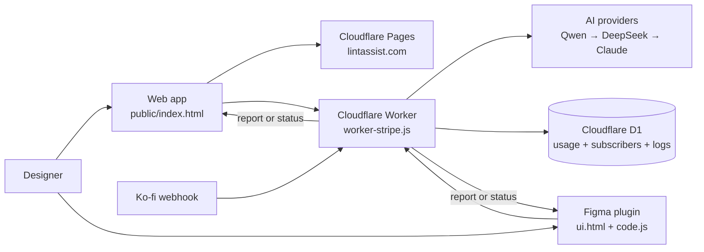

# LintAssist Architecture

## System diagram

## Request flow

1. The web app receives a screenshot, or the plugin exports the selected
   Figma frame as an image.
2. The client sends the image and selected frameworks to `/analyze` with
   either an anonymous `free_` token or a registered token.
3. The Worker checks usage, sends the request through the provider fallback
   chain, normalizes the response, and logs model/cost metadata.
4. The web app renders the report in the browser. The plugin renders it in
   the UI and can place a copy on the Figma canvas.
5. Access and usage are stored in D1. Screenshots and reports are not stored.

## Boundaries

- `public/` is the static web product and is copied to `dist/` by the build.
- `figma-plugin/` is loaded by Figma from `manifest.json`.
- `worker-stripe.js` owns API, access, usage, provider fallback, webhooks,
  and admin endpoints.
- `migrations/` contains the D1 schema changes applied before Worker code
  that depends on them is deployed.
- Secrets stay in Cloudflare Worker secrets, never in browser code.

## Deployment order

1. Validate the web and plugin files locally.
2. Apply any new D1 migration.
3. Deploy the Worker.
4. Build and deploy the Pages output.
5. Test one anonymous audit, one registered audit, and one plugin audit.
6. Publish the Figma plugin update from Figma Desktop.
