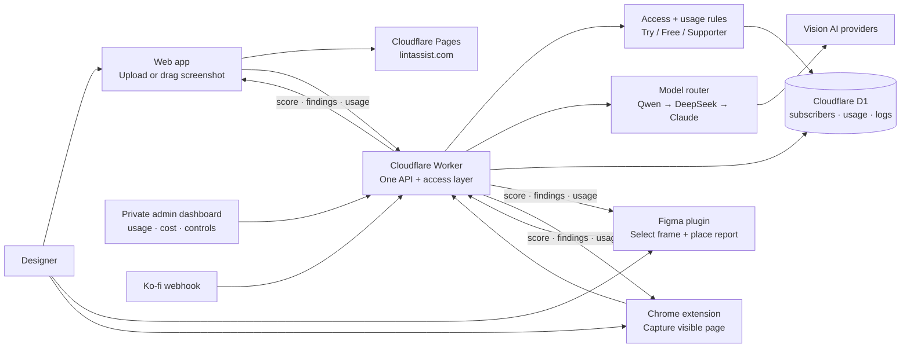

# LintAssist Architecture

LintAssist is one audit service with three entry points: the web app for
screenshots, the Figma plugin for frames, and the Chrome extension for live
web pages. Each surface keeps its own interaction model, but they share the
same Worker, access tokens, usage rules, model fallback, and report shape.

## System diagram



```text
┌─────────────────┐                     ┌───────────────────────────┐         ┌──────────────────────────┐
│      User       ├────────────────────►│          Web app          ├────────►│     Cloudflare Pages     │
│   (Designer)    │                     │     public/index.html     │         │      lintassist.com      │
└────────┬────────┘                     └───────┬───────────▲───────┘         └──────────────────────────┘
         │                                      │           │
         │                        audit request │           │ report or status
         │                                      ▼           │
         │                              ┌───────────────────┴───────┐         ┌──────────────────────────┐
         │                              │     Cloudflare Worker     ├────────►│       AI providers       │
         │                              │     worker-stripe.js      ├──┐      │ Qwen → DeepSeek → Claude │
         │                              └───┬───────▲───────────▲───┘  │      └──────────────────────────┘
         │                                  │       │           │      │
         │                  report / status │       │ audit     │      │      ┌──────────────────────────┐
         │                                  │       │ request   │      └─────►│      Cloudflare D1       │
         │                                  ▼       │           │             │usage + subscribers + logs│
         │                              ┌───┴───────┴───────┐   │             └──────────────────────────┘
         └─────────────────────────────►│   Figma plugin    │   │
                                        │ ui.html + code.js │   │ webhook     ┌──────────────────────────┐
                                        └───────────────────┘   └─────────────┤      Ko-fi webhook       │
                                                                              └──────────────────────────┘
```

## Why one Worker matters

- **One source of truth**: the same token means the same access level and
  remaining balance in web, Figma, and Chrome.
- **One safety boundary**: screenshots go to the Worker only when the user
  chooses Analyze; the clients do not contain provider keys.
- **One model strategy**: the Worker tries the lower-cost vision models first
  and falls back to Claude when needed. Users receive the same report shape,
  while the admin view can see which engine served each request.
- **One product loop**: a user can start in Chrome, continue in Figma, and
  use the web app for any screenshot without creating separate accounts.

## Channel capabilities

| Channel | Best moment | Input | Output |
| --- | --- | --- | --- |
| Web app | Reviewing a screenshot, mockup, or live-site capture | Upload, drag and drop, or paste a screenshot | Score, summary, ranked findings, recommendations, copyable report |
| Figma plugin | Reviewing work before critique or handoff | Selected Figma frame | Same audit report plus **Place in Figma** canvas frame |
| Chrome extension | Checking a live page while browsing | Captured visible tab | Score, summary, findings, copyable report in the side panel |

All channels include the shared framework choices: Nielsen Heuristics,
Visual Hierarchy, Gestalt, Typography, Color & Contrast/WCAG, Accessibility,
CTA & Conversion, and Mobile Readiness. The default starting set is Nielsen
Heuristics, Gestalt, and Accessibility.

## Request flow

1. The user chooses a surface and supplies a screenshot, frame, or visible
   page capture.
2. The client shows the audit steps, validates the selected criteria, and
   sends the image plus framework list to `POST /analyze`.
3. The Worker verifies the anonymous or saved token, checks the correct usage
   period, and applies the Try, Free, or Supporter allowance.
4. The model router tries Qwen first, then DeepSeek, then Claude as fallback.
   The response is normalized to one JSON report shape.
5. The Worker logs model, token, and estimated cost metadata in D1. It does
   not store the screenshot or report.
6. The client renders a 0–100 score, executive summary, and ranked findings.
   Figma can place a copy back on the canvas; web and Chrome can copy it.

## Access and usage

- **Try**: two anonymous audits using a `free_` token, no signup.
- **Free**: email-based token with five audits per day; the same token works
  in all three channels.
- **Supporter**: a Ko-fi tip grants bonus audits to the same email/token.
- Usage is keyed by the plan's actual period: daily for Free and monthly for
  plans configured as monthly. Bonus credits are depleting credits, not a
  permanent limit increase.

## Components

- `public/index.html` — static web app and screenshot workflow.
- `figma-plugin/ui.html` + `code.js` — plugin UI, frame export, and canvas
  placement.
- `chrome-extension/sidepanel.html` + `sidepanel.js` — Chrome side panel,
  visible-tab capture, token storage, progress, and report rendering.
- `worker-stripe.js` — API, access, usage, model routing, webhooks, and admin
  endpoints.
- `public/admin/index.html` — private operational dashboard for subscribers,
  daily usage, trial traffic, costs, model mix, and settings.
- Cloudflare D1 — subscribers, period-keyed usage, request logs, settings,
  signup guards, and Ko-fi donation records.

## Deployment order

1. Validate web, plugin, and extension files locally.
2. Apply any new D1 migration.
3. Deploy the Worker so all channels use the same API behavior.
4. Build and deploy the Pages output.
5. Load the Chrome extension unpacked or publish a reviewed package.
6. Test anonymous, Free, and Supporter usage in all three channels.
7. Publish the Figma update from Figma Desktop.
